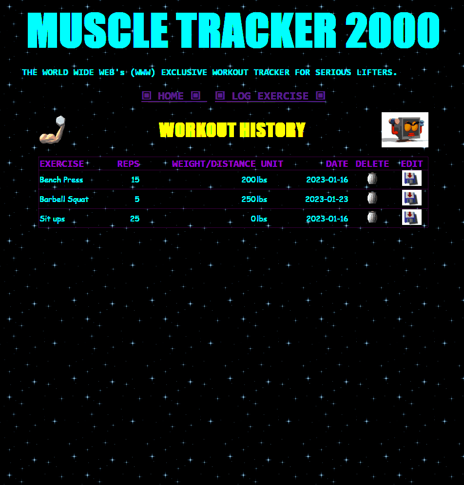

# Workout Tracking App - Demo Project

Reprehensible geocities-era UX/UI aside, this project was an initial exploration in building an app via the MERN (MongoDB, Express, React, Node) stack. The project is split into two primary parts:
### Backend
  - Node application built on the Express framework. 
  - Mongoose library manages a free-tier MongoDB instance deployed via MongoDB cloud database service. 
    - Cloud DB (Mongoose ATLAS) connection details are defined in .env file placed in the `backend` directory.
### Frontend
  - Designed with modern React. 
  - Single Page Application (SPA) implementation, with URL changes managed by React Router.
  
 
  

